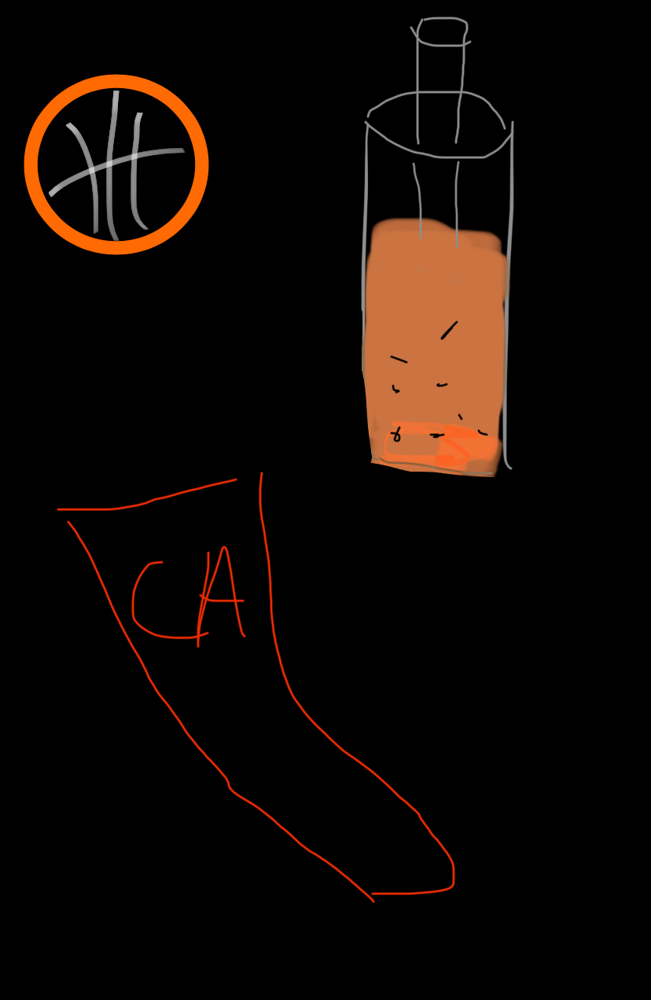

## Tejas' Blog 

## About Me:
My name is Tejas and I'm a sophomore at Del Norte High School. I like basketball, boba, and I live in California. I took this class because it's challenging, and seemed like it would be fun.

## Me!

## My Schedule

| Period      | Class |
| ----------- | ---------- |
|1    | AP Computer Science       |
|2    | AP Calculus        |
|3    | AP World History       |
|4    | Honors Humanities        |
|5    | AP Biology        |

## Go to My Page:
This is my [Github page](https://github.com/TejM123){:target="_blank"}!

## Hacks

Run bundle install where the Gemfile is located. Then download PyYaml and nbconvert which will run your make command. Copy the link after running make command. The file to edit the blog is index.md. You can also use the notebooks to create other blogs to edit to your liking. You can use ls to list all the files in a directory. Use cd to switch between directories. You use pip3 install to download. mkdir helps you make a directory. In order to check your version number, type "software name" --version.

## Calculator

<head>
<meta charset="UTF-8">
<meta name="viewport" content="width=device-width, initial-scale=1.0">

<title>Calculator</title>
</head>
<body>
  

    
0

    

      <button onclick="appendToOutput('7')">7</button>
      <button onclick="appendToOutput('8')">8</button>
      <button onclick="appendToOutput('9')">9</button>
      <button onclick="appendToOutput('+')">+</button>
      <button onclick="appendToOutput('4')">4</button>
      <button onclick="appendToOutput('5')">5</button>
      <button onclick="appendToOutput('6')">6</button>
      <button onclick="appendToOutput('-')">-</button>
      <button onclick="appendToOutput('1')">1</button>
      <button onclick="appendToOutput('2')">2</button>
      <button onclick="appendToOutput('3')">3</button>
      <button onclick="appendToOutput('*')">x</button>
      <button onclick="appendToOutput('0')">0</button>
      <button onclick="calculate()">=</button>
      <button onclick="clearOutput()">C</button>
      <button onclick="appendToOutput('/')">/</button>

  

  
</body>